<div align="center">

# Cairn Analytics

### Churn prediction and data observability platform for B2B SaaS

A complete, production-shaped data platform that answers the three questions every SaaS business asks:
how much recurring revenue is coming in, which customers are about to leave, and can these numbers be trusted today.


[Français](README.md) - **English**

</div>

---

<div align="center">

### Live dashboard preview

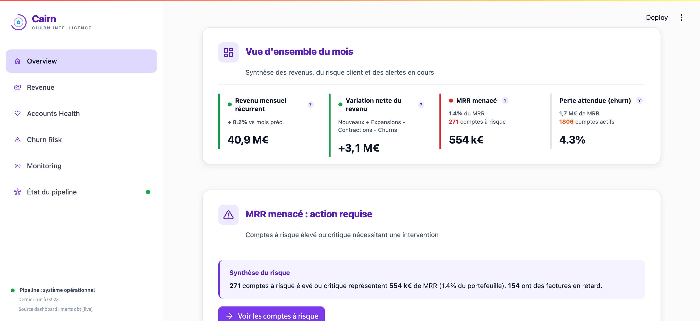

</div>

---

## Table of contents

1. [Overview](#1-overview)
2. [Key capabilities](#2-key-capabilities)
3. [Architecture](#3-architecture)
4. [Data model](#4-data-model)
5. [Tech stack and rationale](#5-tech-stack-and-rationale)
6. [Getting started](#6-getting-started)
7. [Common commands](#7-common-commands)
8. [The dashboard](#8-the-dashboard)
9. [Project structure](#9-project-structure)
10. [Testing and CI](#10-testing-and-ci)
11. [Observability](#11-observability)
12. [Extending the platform](#12-extending-the-platform)
13. [Limitations and next steps](#13-limitations-and-next-steps)
14. [Documentation](#14-documentation)

## 1. Overview

In a subscription business, revenue depends on retention: losing existing customers (churn) is more expensive than acquiring new ones. Yet in many companies the revenue KPIs live in spreadsheets, nobody has a prioritized list of at-risk accounts, and when a prediction model silently degrades, nobody notices until the numbers are wrong.

Cairn Analytics is a working reference implementation of the data platform a modern SaaS team would build to solve this. It covers the full chain, in code, tested, and runnable on a laptop:

- Realistic synthetic data is generated and loaded into a PostgreSQL warehouse.
- dbt transforms it into a star schema where every revenue and engagement KPI is one query away.
- A churn model (logistic regression baseline, XGBoost challenger) scores every account and explains each score with its top risk drivers.
- Predictions are served through a REST API and a multipage analytics dashboard.
- Data quality is enforced before transformation (Great Expectations), after transformation (dbt tests), and at runtime (Evidently drift reports).
- The whole pipeline is orchestrated by Prefect, tracked by MLflow, and monitored by Prometheus and Grafana.

Everything runs locally with Docker. No cloud account, no cost.

The whole loop in one picture - ingest, validate, train, monitor:

<div align="center">

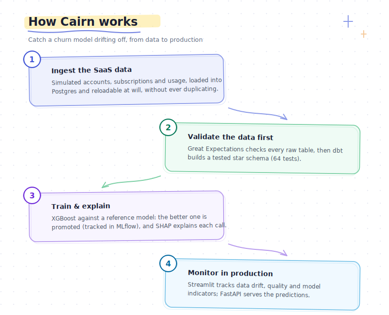

</div>

## 2. Key capabilities

| Domain | What is implemented |
|--------|---------------------|
| Ingestion | Idempotent loaders (COPY into temporary tables, insert with conflict handling on natural keys). The pipeline is safe to re-run any number of times. |
| Transformation | dbt star schema: 5 staging views, 3 intermediate models, 4 dimensions, 4 fact tables, 1 flat account health mart. 40+ schema tests and 4 custom SQL invariants. |
| Machine learning | Logistic regression baseline and XGBoost challenger, class imbalance handling, PR-AUC champion gate, MLflow tracking and model registry. |
| Explainability | SHAP top-3 risk drivers computed per account at prediction time and stored with each score. |
| Input data quality | Great Expectations: 5 suites (about 23 checks) on raw tables, run before dbt so bad inputs never reach the modelling layer. |
| Drift monitoring | Evidently reports on data drift, target drift and model performance, generated at every prediction cycle. |
| Serving | FastAPI with Pydantic v2 validation: single prediction, batch prediction and health endpoints, Prometheus metrics exposed. |
| Dashboard | Streamlit multipage application: overview, revenue, account health, churn risk, model monitoring, pipeline status. |
| Orchestration | Prefect 3: a daily refresh flow and an intraday prediction flow, with retries. |
| Observability | Prometheus metrics, Grafana with two provisioned dashboards (API SLO, pipeline health), Loki and Promtail for log aggregation. |
| Governance | GDPR design study: personal data inventory on the actual schema, data-subject-rights designs (access, erasure, opt-out), retention targets, with an explicit split between what the code ships and what a production rollout adds. |
| CI | GitHub Actions: lint, unit tests, integration tests, SQL lint and Docker image builds on every push. |

## 3. Architecture

<div align="center">

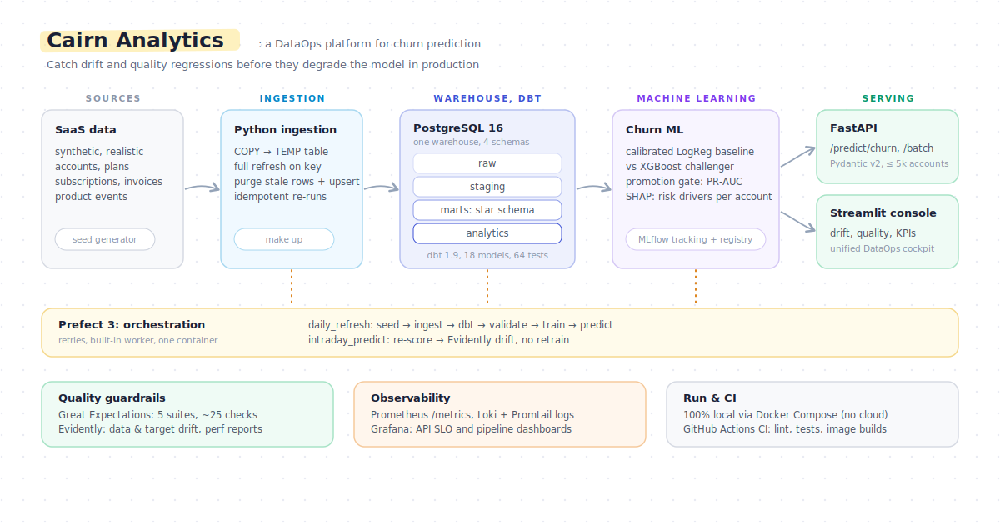

</div>

Everything runs on the developer host with `docker compose`: Prefect schedules the compute jobs (seed, ingestion, Great Expectations, dbt, training, scoring), Postgres holds the four schemas, MLflow tracks experiments and the model registry, and FastAPI plus Streamlit read from the warehouse. The full architectural narrative, including the schema breakdown and the reasoning behind each technology choice, is in [`docs/architecture.md`](docs/architecture.md).

## 4. Data model

The warehouse follows a star schema in the `marts` layer:

| Layer | Tables |
|-------|--------|
| Dimensions | `dim_account`, `dim_plan`, `dim_date`, `dim_industry` |
| Facts | `fct_mrr_monthly`, `fct_mrr_movements`, `fct_engagement_daily`, `fct_tickets_monthly` |
| Canonical mart | `mart_account_health` (one row per account, the single source of truth for ML features and the dashboard) |

`fct_mrr_movements` is the keystone: one row per month and account, with a movement type (`new`, `expansion`, `contraction`, `churn`, `steady`). Every standard SaaS KPI becomes a single aggregation:

| KPI | Source |
|-----|--------|
| MRR / ARR | `fct_mrr_monthly` |
| Net New MRR, NRR, GRR | `fct_mrr_movements` |
| Logo churn | `fct_mrr_movements` filtered on churn movements |
| DAU / MAU / stickiness | `fct_engagement_daily` |
| Account health distribution | `mart_account_health` |
| Churn risk by tier | `analytics.churn_predictions` |

## 5. Tech stack and rationale

| Layer | Choice | Why |
|-------|--------|-----|
| Warehouse | PostgreSQL 16 | Free, local, identical semantics in development and production; the whole pipeline fits on a laptop. |
| Transformation | dbt-core 1.9 | Declarative, testable, versioned SQL. |
| ML | scikit-learn + XGBoost + SHAP | An inspectable baseline, a strong challenger, and per-account explanations. |
| Experiment tracking | MLflow 2.19 | Tracking and model registry on the same Postgres instance, no second datastore. |
| Input data quality | Great Expectations | Compact in-code runner for 5 suites; a full GE project tree would be oversized at this scope. |
| Drift monitoring | Evidently | Drift and performance in one report; degrades gracefully to a JSON summary if optional dependencies are missing. |
| Orchestration | Prefect 3.1 | Pythonic flows, retries as keyword arguments, server fits in one container. |
| API | FastAPI + Pydantic v2 | Schema validation and OpenAPI documentation out of the box. |
| Dashboard | Streamlit 1.40 + Plotly | The fastest path from a DataFrame to something a business stakeholder can use. |
| Synthetic data | Faker + numpy | Deterministic, no licensing or freshness issues. |
| Containers | Docker Compose | One command boots the whole stack, identical to what CI runs. |
| CI | GitHub Actions | Free for public repositories; matrix of lint, unit, integration and slow jobs. |

## 6. Getting started

**Prerequisites:** Docker Desktop (or Docker Engine with the compose plugin) and `make`.

```bash
make up
```

That's it. `make up` (alias of `docker compose up -d`) boots the full
stack, and a dedicated `bootstrap` service runs the entire pipeline
(`seed, ingest, dbt build, Great Expectations, train + register to
MLflow Production, batch predict, Evidently drift report`) before
Streamlit comes up. Streamlit depends on `bootstrap` via
`service_completed_successfully`, so the dashboard never opens on an
empty database. Every page opens in **live** mode, every time.

Want to refresh the data without restarting the stack?

```bash
make refresh   # re-runs the bootstrap service only
```

| Service | URL |
|---------|-----|
| Dashboard (Streamlit) | http://localhost:8601 |
| API documentation (FastAPI) | http://localhost:8100/docs |
| MLflow | http://localhost:5001 |
| Prefect | http://localhost:4200 |
| Grafana (optional, `make observability`) | http://localhost:3200 |
| Prometheus (optional) | http://localhost:9090 |

The first full `make up` run takes about 8 to 12 minutes on a laptop (it includes image builds and the bootstrap pipeline). Subsequent runs are incremental and take about 2 minutes; `make refresh` re-runs the bootstrap only and takes about 1 minute.

**Configuration.** The stack runs with no setup required: `make up` relies on local development credentials (Postgres `cairn` / `password`, Grafana `admin` / `admin`), intended for local use only. These are not production secrets: no value is hardcoded in `docker-compose.yml`, all are supplied through environment variables (`${VAR:-default}`). To set your own values, copy the example file (the `.env` is ignored by Git) and edit it:

```bash
cp .env.example .env
```

## 7. Common commands

The Makefile is the single entry point; `make help` lists everything.

```bash
# Lifecycle (the only commands most users need)
make up                 # start everything + bootstrap pipeline (live data ready)
make down               # stop services, keep volumes
make refresh            # re-run the bootstrap (refresh data without restart)
make rebuild            # destructive: drop volumes, fresh database, fresh pipeline

# Individual pipeline steps (power-user / debug, normally run by the bootstrap service)
make seed               # (re)generate synthetic CSVs
make ingest             # load CSVs into raw tables
make dbt-build          # dbt deps + run + test
make ge                 # run Great Expectations suites
make ml-train           # train baseline + challenger, tracked in MLflow
make ml-predict         # batch predictions into analytics.churn_predictions
make evidently          # drift + performance reports

# Tests and quality
make test-unit          # fast unit tests
make test-integration   # integration tests against a real Postgres
make test               # both
make lint               # ruff on every Python module

# Observability (optional profile, Grafana + Loki + Promtail)
make observability      # prometheus :9090, grafana :3200, loki :3100
make obs-down
```

## 8. The dashboard

The Streamlit application (`app.py`) is a multipage analytics console branded "Cairn". It reads directly from the warehouse (`marts.*` and `analytics.churn_predictions`). The `bootstrap` service runs the full pipeline before Streamlit starts, so every page opens on live data, every time. A per-source synthetic fallback exists only as a resilience net if a backend service goes down mid-session; in that case the affected widget is explicitly labelled "simulé", never presented as real.

| Page | Content |
|------|---------|
| Overview | Executive snapshot: revenue, net movement, account health and churn risk at a glance. |
| Revenue | MRR trend and waterfall, net revenue retention, movement breakdown. |
| Accounts Health | Health score distribution and per-account detail. |
| Churn Risk | Ranked at-risk accounts with risk tier and the SHAP drivers behind each score. |
| Monitoring | Data quality results, drift status and model performance metrics. |
| Pipeline | Orchestration runs, ingestion freshness, API latency and model status. |

A 30-second guided tour of the six pages:

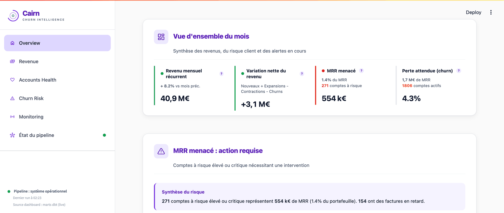

A closer look at four of them:

<table>
  <tr>
    <td align="center" width="50%">
      <strong>Revenue</strong> - MRR trend, waterfall, net revenue retention<br><br>
      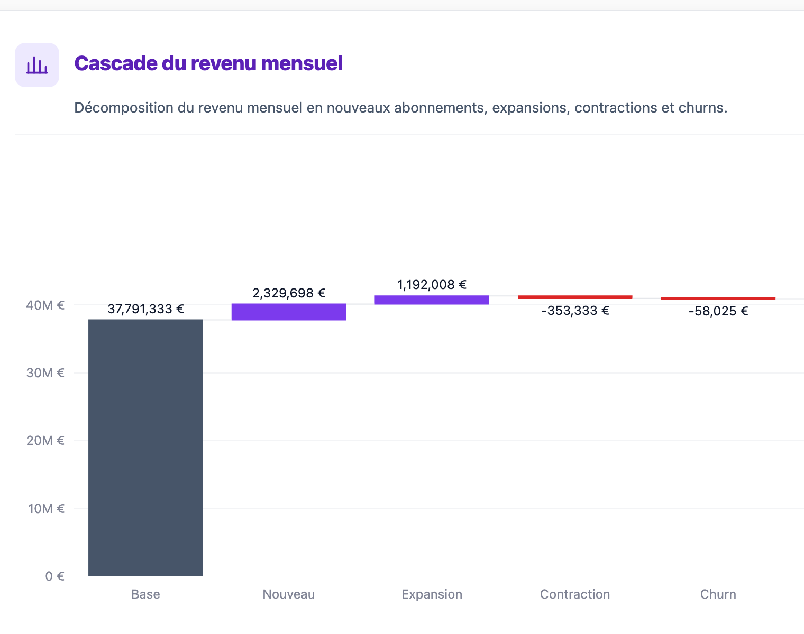
    </td>
    <td align="center" width="50%">
      <strong>Churn Risk</strong> - ranked at-risk accounts with SHAP drivers<br><br>
      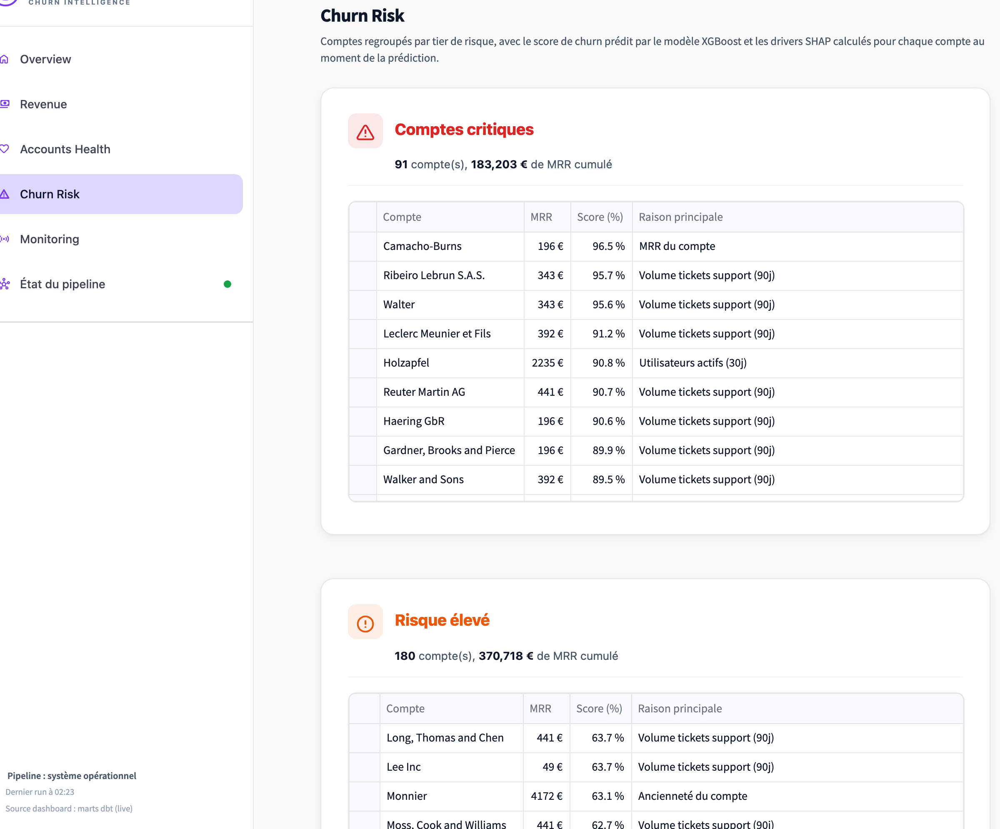
    </td>
  </tr>
</table>

**Monitoring** - data quality, drift (PSI) and model performance, across three tabs:

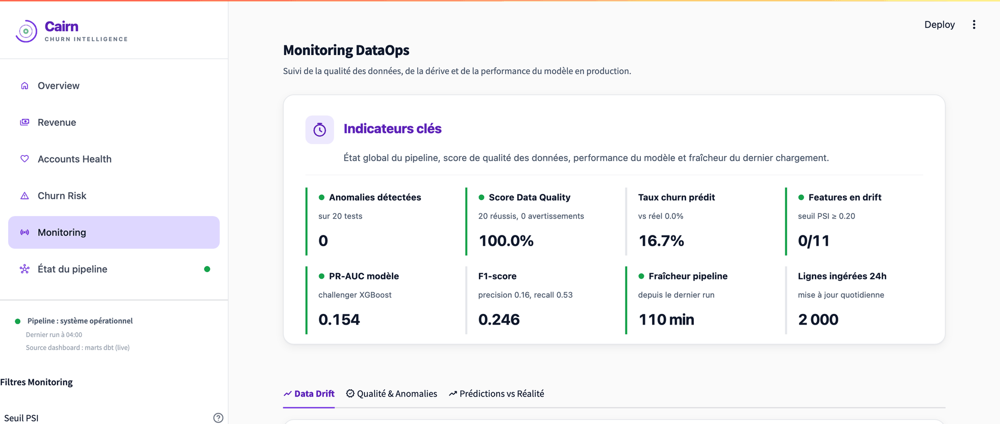

**Pipeline** - orchestration runs, freshness, API latency (live):

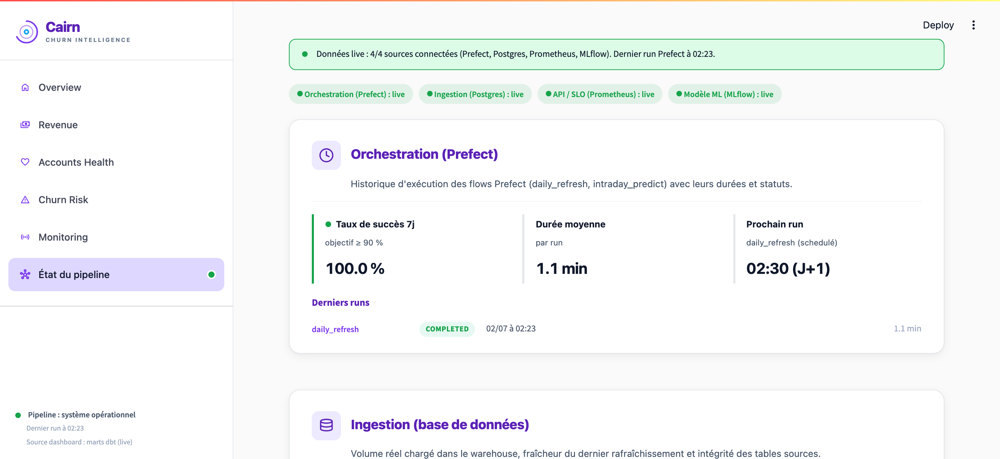

Drilling into a single account to read why the model flagged it:

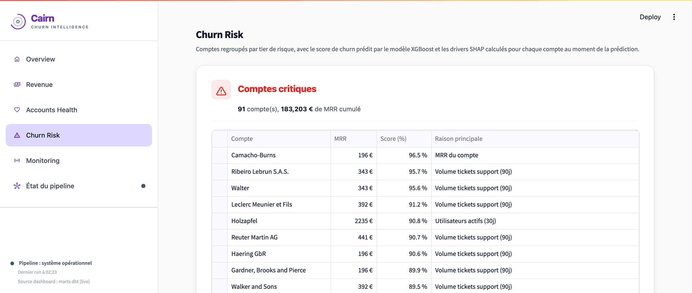

## 9. Project structure

```
cairn-analytics/
├── seed/, ingestion/, sql/          # synthetic data and Postgres loading
├── dbt/                             # staging, intermediate, marts + SQL tests
├── great_expectations/, monitoring/ # data quality (GE) and drift (Evidently)
├── ml/                              # features, training, prediction, SHAP
├── api/                             # FastAPI prediction service
├── app.py, pages/, ui/, data/       # multipage Streamlit dashboard
├── flows/                           # Prefect 3 orchestration
├── observability/                   # Prometheus, Loki, Promtail, Grafana
├── pipeline/, streamlit/            # Docker images for jobs and dashboard
├── tests/                           # unit + integration (testcontainers)
├── docs/                            # architecture, ML, data quality, GDPR, observability
├── Makefile, docker-compose.yml     # developer CLI and local stack
└── .github/workflows/               # CI (lint, tests, image builds)
```

The folder-by-folder detail (services, volumes, data flow) is covered in [docs/architecture.md](docs/architecture.md).

## 10. Testing and CI

| Tier | Coverage |
|------|----------|
| dbt schema tests | `not_null`, `unique`, `accepted_values`, `relationships` on staging and mart tables (40+ tests). |
| dbt singular tests | 4 SQL invariants, including an MRR movements reconciliation check. |
| Python unit tests | Seed determinism, ingestion idempotency, feature building, metrics, API routes, quality runner, flow ordering. |
| Integration tests | Real Postgres via testcontainers: schema checks, ingestion round-trip, live quality run, dbt build. |
| Linters | ruff (Python), sqlfluff (SQL). |

```bash
make test-unit          # about 5 seconds
make test-integration   # about 60 seconds, spins up Postgres
```

CI runs four jobs on every push (`lint-and-unit`, `integration`, `sql-lint`, and a manually triggered `slow` job) plus a Docker build workflow that verifies every image compiles.

## 11. Observability

An observability stack ships with the project. Grafana, Loki and Promtail are gated behind a compose profile so the base stack stays lean; Prometheus, however, runs with the base stack on purpose, because the dashboard's Pipeline page reads API latency from it:

- Prometheus scrapes the API's `/metrics` endpoint.
- Loki and Promtail aggregate the logs of every container.
- Grafana auto-provisions two dashboards: API SLO (latency percentiles, error budget) and pipeline health (revenue, churn and data quality panels).

One command starts it all: `make observability`. Details in [`docs/observability.md`](docs/observability.md).

Alongside the Grafana dashboards, the MLflow registry tracks model lineage and stage transitions:

<table>
  <tr>
    <td align="center" width="50%">
      <strong>Grafana</strong> - API SLO: latency percentiles, error budget<br><br>
      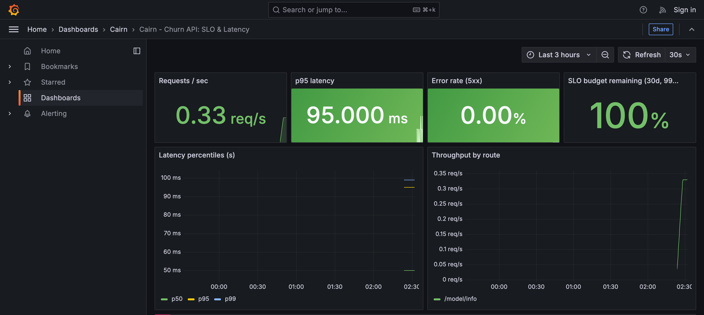
    </td>
    <td align="center" width="50%">
      <strong>MLflow</strong> - registry, challenger promoted to Production<br><br>
      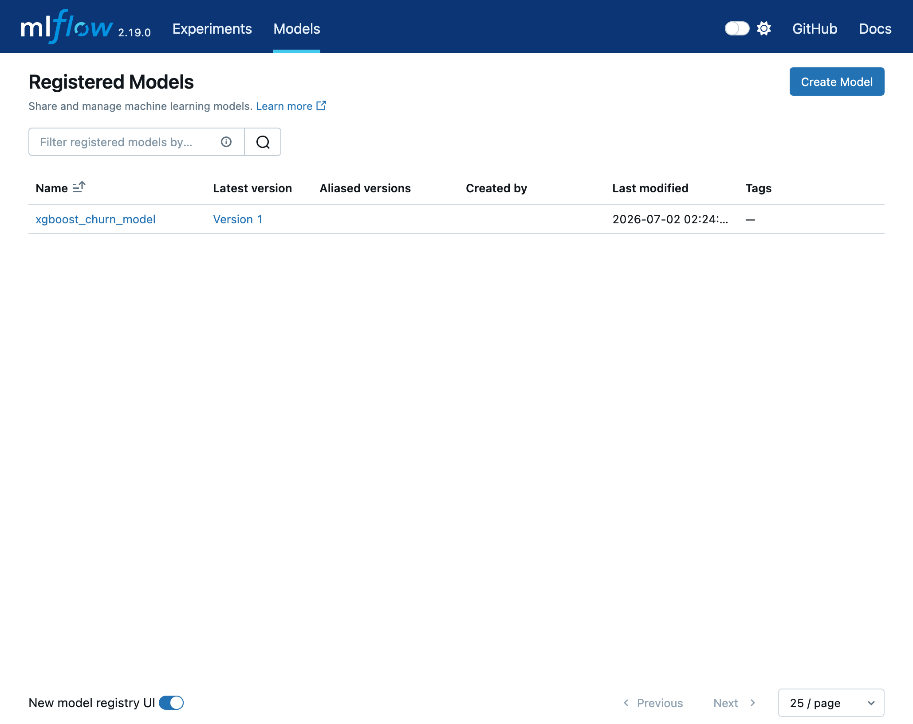
    </td>
  </tr>
</table>

## 12. Extending the platform

Each concern is isolated, which keeps changes local:

- Change data volume: edit `seed/config.py` (`n_accounts`, `churn_rate`, plan mix).
- Add a source table: one entry in `ingestion/loaders.py`, a staging view, and a line in `sources.yml`.
- Add a KPI: a new model in `dbt/models/marts/`.
- Add a model feature: append to `ml/features.py` (`FEATURE_COLUMNS`); the feature builder picks it up automatically.
- Swap the warehouse for Snowflake or BigQuery: change the dbt profile and the connection string; the modelling layer is unchanged.
- Swap Streamlit for another BI tool: the canonical datasets are `mart_account_health` and `analytics.churn_predictions`; any tool can read them.

## 13. Limitations and next steps

Known trade-offs, made on purpose and worth stating up front:

- **The data is synthetic.** Generated by `seed/` (Faker + numpy, deterministic). The churn signal is injected by construction, so model metrics (ROC-AUC ~0.97 on a test set of ~80 accounts) measure the pipeline's correctness, not real-world predictive power. Metrics ship with bootstrap confidence intervals to make the small-sample uncertainty visible.
- **No API authentication.** The API serves a local, single-tenant demo; adding OAuth2/API keys is straightforward FastAPI middleware but would complicate the one-command startup.
- **Prometheus runs in the base stack, not the `obs` profile.** Deliberate: the dashboard's Pipeline page reads API latency from it, and the goal is a fully live dashboard out of the box.
- **The API serves the local pickle, not the MLflow registry.** The registry records lineage and stage transitions; serving stays on a local artifact to keep the inference path free of network dependencies. A production setup would pull `models:/xgboost_churn_model/Production` at startup.
- **Single-node everything.** Postgres, one uvicorn worker, compose instead of Kubernetes. Scaling paths are documented in `docs/architecture.md` §6.
- **Next steps:** unit tests for `ml/predict.py` and `ml/shap_explain.py`, Terraform deployment to a cloud target.

## 14. Documentation

| Document | Content |
|----------|---------|
| [`docs/market_context.md`](docs/market_context.md) | The SaaS business problem this project addresses. |
| [`docs/architecture.md`](docs/architecture.md) | Full topology and technology rationale. |
| [`docs/ml_modelling.md`](docs/ml_modelling.md) | Problem framing, features, split strategy, models, metrics, SHAP. |
| [`docs/data_quality.md`](docs/data_quality.md) | The three quality layers: Great Expectations, dbt, Evidently. |
| [`docs/governance_rgpd.md`](docs/governance_rgpd.md) | GDPR posture, data subject rights, retention policy. |
| [`docs/observability.md`](docs/observability.md) | Metrics, logs, dashboards and alerts. |

---

<div align="center">

Built by **Lohana Utim** - Cairn Analytics

</div>
