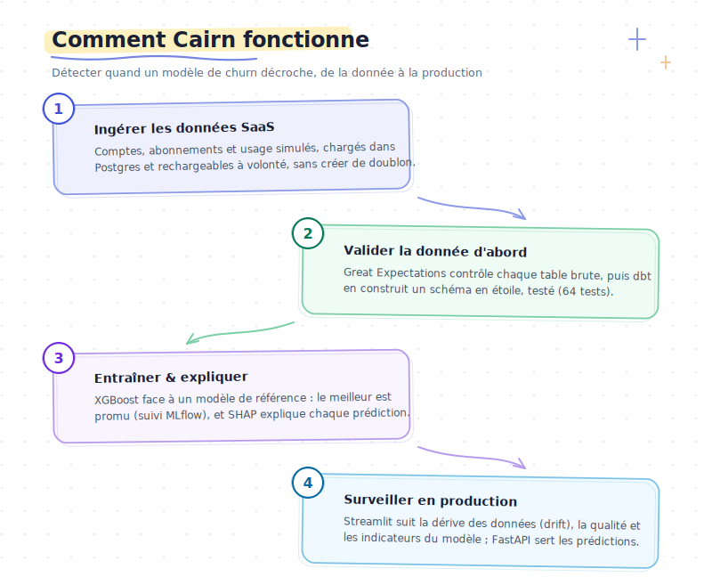
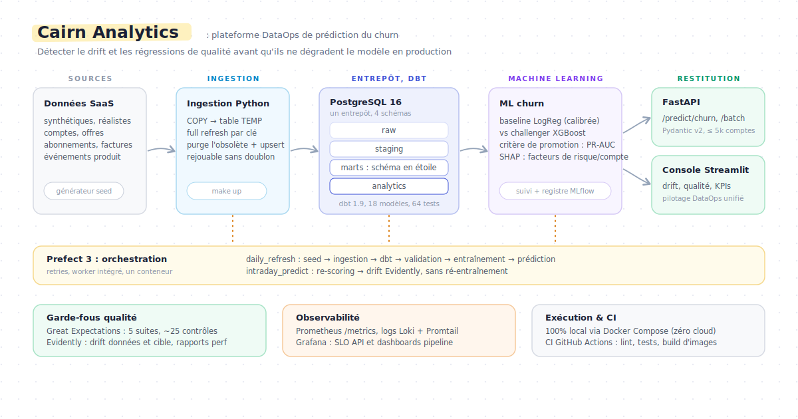

<div align="center">

# Cairn Analytics

### Plateforme de prédiction du churn et d'observabilité data pour le SaaS B2B

Une plateforme data complète, calquée sur la production, qui répond aux trois questions que pose toute entreprise SaaS :
combien de revenu récurrent rentre, quels clients sont sur le point de partir, et peut-on faire confiance à ces chiffres aujourd'hui.


**Français** - [English](README.en.md)

</div>

---

<div align="center">

### Aperçu du dashboard live


</div>

---

## Sommaire

1. [Présentation](#1-présentation)
2. [Fonctionnalités clés](#2-fonctionnalités-clés)
3. [Architecture](#3-architecture)
4. [Modèle de données](#4-modèle-de-données)
5. [Stack technique et justifications](#5-stack-technique-et-justifications)
6. [Démarrage](#6-démarrage)
7. [Commandes courantes](#7-commandes-courantes)
8. [Le dashboard](#8-le-dashboard)
9. [Structure du projet](#9-structure-du-projet)
10. [Tests et CI](#10-tests-et-ci)
11. [Observabilité](#11-observabilité)
12. [Étendre la plateforme](#12-étendre-la-plateforme)
13. [Limites et prochaines étapes](#13-limites-et-prochaines-étapes)
14. [Documentation](#14-documentation)

## 1. Présentation

Dans une entreprise par abonnement, le revenu dépend de la rétention : perdre un client existant (churn, ou attrition) coûte plus cher qu'en acquérir un nouveau. Pourtant, dans beaucoup d'entreprises, les KPIs de revenu vivent dans des tableurs, personne ne dispose d'une liste priorisée des comptes à risque, et quand un modèle de prédiction se dégrade silencieusement, personne ne s'en aperçoit avant que les chiffres soient faux.

Cairn Analytics est une implémentation de référence de la plateforme data qu'une équipe SaaS moderne construirait pour résoudre ce problème. Elle couvre toute la chaîne, en code, testée, et exécutable sur un laptop :

- Des données synthétiques réalistes sont générées et chargées dans un entrepôt PostgreSQL.
- dbt les transforme en schéma en étoile où chaque KPI de revenu et d'engagement est à une requête près.
- Un modèle de churn (baseline régression logistique, challenger XGBoost) note chaque compte et explique chaque score par ses principaux facteurs de risque.
- Les prédictions sont servies par une API REST et un dashboard analytique multipage.
- La qualité des données est contrôlée avant transformation (Great Expectations), après transformation (tests dbt) et à l'exécution (rapports de dérive Evidently).
- L'ensemble est orchestré par Prefect, tracé par MLflow, et supervisé par Prometheus et Grafana.

Tout tourne en local avec Docker. Aucun compte cloud, aucun coût.

Toute la boucle en une image - ingérer, valider, entraîner, surveiller :

<div align="center">



</div>

## 2. Fonctionnalités clés

| Domaine | Ce qui est implémenté |
|---------|------------------------|
| Ingestion | Loaders idempotents (COPY vers tables temporaires, insertion avec gestion de conflit sur les clés naturelles). Le pipeline peut être relancé autant de fois que nécessaire. |
| Transformation | Schéma en étoile dbt : 5 vues staging, 3 modèles intermédiaires, 4 dimensions, 4 tables de faits, 1 mart de santé des comptes. Plus de 40 tests de schéma et 4 invariants SQL. |
| Machine learning | Baseline régression logistique et challenger XGBoost, gestion du déséquilibre de classes, sélection du champion sur la PR-AUC, tracking et registre MLflow. |
| Explicabilité | Top 3 des facteurs de risque SHAP calculés par compte au moment de la prédiction et stockés avec chaque score. |
| Qualité des données d'entrée | Great Expectations : 5 suites (environ 23 contrôles) sur les tables raw, exécutées avant dbt pour que les données défectueuses n'atteignent jamais la couche de modélisation. |
| Suivi de dérive | Rapports Evidently sur la dérive des données, de la cible et de la performance du modèle, générés à chaque cycle de prédiction. |
| Serving | FastAPI avec validation Pydantic v2 : endpoints de prédiction unitaire, batch et de santé, métriques Prometheus exposées. |
| Dashboard | Application Streamlit multipage : vue d'ensemble, revenu, santé des comptes, risque de churn, monitoring du modèle, état du pipeline. |
| Orchestration | Prefect 3 : un flow de rafraîchissement quotidien et un flow de prédiction intra-journalier, avec retries. |
| Observabilité | Métriques Prometheus, Grafana avec deux dashboards provisionnés (SLO API, santé du pipeline), Loki et Promtail pour l'agrégation des logs. |
| Gouvernance | Étude de conception RGPD : inventaire des données personnelles sur le schéma réel, conception des droits des personnes (accès, effacement, opt-out), cibles de rétention, avec une séparation explicite entre ce que le code livre et ce qu'un déploiement production ajoute. |
| CI | GitHub Actions : lint, tests unitaires, tests d'intégration, lint SQL et build des images Docker à chaque push. |

## 3. Architecture

<div align="center">



</div>

Tout tourne sur le poste développeur avec `docker compose` : Prefect planifie les jobs de calcul (seed, ingestion, Great Expectations, dbt, entraînement, scoring), Postgres héberge les quatre schémas, MLflow trace les expériences et le registre de modèles, et FastAPI plus Streamlit lisent l'entrepôt. Le narratif d'architecture complet, avec la décomposition du schéma et la justification de chaque choix technique, se trouve dans [`docs/architecture.md`](docs/architecture.md).

## 4. Modèle de données

L'entrepôt suit un schéma en étoile dans la couche `marts` :

| Couche | Tables |
|--------|--------|
| Dimensions | `dim_account`, `dim_plan`, `dim_date`, `dim_industry` |
| Faits | `fct_mrr_monthly`, `fct_mrr_movements`, `fct_engagement_daily`, `fct_tickets_monthly` |
| Mart canonique | `mart_account_health` (une ligne par compte, source de vérité unique pour les features ML et le dashboard) |

`fct_mrr_movements` est la clef de voûte : une ligne par mois et par compte, avec un type de mouvement (`new`, `expansion`, `contraction`, `churn`, `steady`). Chaque KPI SaaS standard devient une simple agrégation :

| KPI | Source |
|-----|--------|
| MRR / ARR | `fct_mrr_monthly` |
| Net New MRR, NRR, GRR | `fct_mrr_movements` |
| Logo churn | `fct_mrr_movements` filtré sur les mouvements de churn |
| DAU / MAU / stickiness | `fct_engagement_daily` |
| Distribution de santé des comptes | `mart_account_health` |
| Risque de churn par tier | `analytics.churn_predictions` |

## 5. Stack technique et justifications

| Couche | Choix | Pourquoi |
|--------|-------|----------|
| Entrepôt | PostgreSQL 16 | Gratuit, local, sémantique identique en développement et en production ; tout le pipeline tient sur un laptop. |
| Transformation | dbt-core 1.9 | SQL déclaratif, testable, versionné. |
| ML | scikit-learn + XGBoost + SHAP | Une baseline inspectable, un challenger performant, des explications par compte. |
| Suivi d'expériences | MLflow 2.19 | Tracking et registre de modèles sur la même instance Postgres, pas de second datastore. |
| Qualité des données d'entrée | Great Expectations | Runner compact en code pour 5 suites ; une arborescence GE complète serait surdimensionnée à cette échelle. |
| Suivi de dérive | Evidently | Dérive et performance dans un même rapport ; dégradation propre vers un résumé JSON si les dépendances optionnelles manquent. |
| Orchestration | Prefect 3.1 | Flows pythoniques, retries en arguments, serveur dans un seul conteneur. |
| API | FastAPI + Pydantic v2 | Validation de schéma et documentation OpenAPI sans effort supplémentaire. |
| Dashboard | Streamlit 1.40 + Plotly | Le chemin le plus court d'un DataFrame à un outil utilisable par un interlocuteur métier. |
| Données synthétiques | Faker + numpy | Déterministes, sans problème de licence ni de fraîcheur. |
| Conteneurs | Docker Compose | Une commande démarre toute la stack, identique à ce que la CI exécute. |
| CI | GitHub Actions | Gratuit pour les dépôts publics ; matrice lint, unit, intégration et jobs lents. |

## 6. Démarrage

**Prérequis :** Docker Desktop (ou Docker Engine avec le plugin compose) et `make`.

```bash
make up
```

C'est tout. `make up` (alias de `docker compose up -d`) démarre toute la
stack, et un service dédié `bootstrap` exécute l'intégralité du pipeline
(`seed, ingest, dbt build, Great Expectations, entraînement +
enregistrement MLflow Production, prédictions batch, rapport de dérive
Evidently`) AVANT que Streamlit ne démarre. Streamlit dépend de `bootstrap`
via `service_completed_successfully`, donc la dashboard ne s'ouvre jamais
sur une base vide. Toutes les pages s'ouvrent en mode **live**, à chaque
lancement.

Besoin de rafraîchir les données sans redémarrer la stack ?

```bash
make refresh   # relance uniquement le service bootstrap
```

| Service | URL |
|---------|-----|
| Dashboard (Streamlit) | http://localhost:8601 |
| Documentation API (FastAPI) | http://localhost:8100/docs |
| MLflow | http://localhost:5001 |
| Prefect | http://localhost:4200 |
| Grafana (optionnel, `make observability`) | http://localhost:3200 |
| Prometheus (optionnel) | http://localhost:9090 |

Le premier `make up` complet prend environ 8 à 12 minutes sur un laptop (builds d'images + bootstrap du pipeline). Les exécutions suivantes sont incrémentales et prennent environ 2 minutes ; `make refresh` ne rejoue que le bootstrap et prend environ 1 minute.

**Configuration.** La stack démarre sans réglage préalable : `make up` s'appuie sur des identifiants de développement local (Postgres `cairn` / `password`, Grafana `admin` / `admin`), réservés à un usage sur votre machine. Ce ne sont pas des secrets de production : aucune valeur n'est codée en dur dans `docker-compose.yml`, toutes sont fournies par variables d'environnement (`${VAR:-défaut}`). Pour définir vos propres valeurs, copiez le fichier d'exemple (le `.env` est ignoré par Git) et adaptez-le :

```bash
cp .env.example .env
```

## 7. Commandes courantes

Le Makefile est le point d'entrée unique ; `make help` liste tout.

```bash
# Étapes du pipeline
make seed               # (re)génère les CSV synthétiques
make ingest             # charge les CSV dans les tables raw
make dbt-build          # dbt deps + run + test
make ge                 # exécute les suites Great Expectations
make ml-train           # entraîne baseline + challenger, tracé dans MLflow
make ml-predict         # prédictions batch vers analytics.churn_predictions
make evidently          # rapports de dérive + performance

# Tests et qualité
make test-unit          # tests unitaires rapides
make test-integration   # tests d'intégration contre un vrai Postgres
make test               # les deux
make lint               # ruff sur tous les modules Python

# Cycle de vie
make down               # arrête les services, conserve les volumes
make rebuild            # destructif : supprime les volumes, base de données neuve

# Observabilité (profil optionnel)
make observability      # prometheus :9090, grafana :3200, loki :3100
make obs-down
```

## 8. Le dashboard

L'application Streamlit (`app.py`) est une console analytique multipage sous la marque « Cairn ». Elle lit directement l'entrepôt (`marts.*` et `analytics.churn_predictions`). Le service `bootstrap` exécute l'intégralité du pipeline avant le démarrage de Streamlit, donc chaque page s'ouvre sur des données live, à chaque lancement. Un fallback synthétique par source existe uniquement comme filet de sécurité si un service backend tombe en cours de session ; dans ce cas, le widget concerné est explicitement étiqueté « simulé », jamais présenté comme réel.

| Page | Contenu |
|------|---------|
| Overview | Vue de synthèse : revenu, mouvement net, santé des comptes et risque de churn en un coup d'œil. |
| Revenue | Tendance et waterfall du MRR, rétention nette du revenu, décomposition des mouvements. |
| Accounts Health | Distribution du score de santé et détail par compte. |
| Churn Risk | Comptes à risque classés, avec tier de risque et facteurs SHAP derrière chaque score. |
| Monitoring | Résultats des contrôles qualité, état de la dérive et métriques de performance du modèle. |
| Pipeline | Exécutions d'orchestration, fraîcheur de l'ingestion, latence de l'API et état du modèle. |

Une visite guidée de 30 secondes des six pages :


Un aperçu de quatre d'entre elles :

<table>
  <tr>
    <td align="center" width="50%">
      <strong>Revenue</strong> - tendance du MRR, waterfall, rétention nette<br><br>
      
    </td>
    <td align="center" width="50%">
      <strong>Churn Risk</strong> - comptes à risque classés, facteurs SHAP<br><br>
      
    </td>
  </tr>
</table>

**Monitoring** - qualité des données, dérive (PSI) et performance du modèle, en trois onglets :


**Pipeline** - exécutions, fraîcheur, latence API (live) :


Zoom sur un compte pour lire pourquoi le modèle l'a signalé :


## 9. Structure du projet

```
cairn-analytics/
├── seed/, ingestion/, sql/          # données synthétiques et chargement Postgres
├── dbt/                             # staging, intermediate, marts + tests SQL
├── great_expectations/, monitoring/ # qualité des données (GE) et dérive (Evidently)
├── ml/                              # features, entraînement, prédiction, SHAP
├── api/                             # service de prédiction FastAPI
├── app.py, pages/, ui/, data/       # dashboard Streamlit multipage
├── flows/                           # orchestration Prefect 3
├── observability/                   # Prometheus, Loki, Promtail, Grafana
├── pipeline/, streamlit/            # images Docker des jobs et du dashboard
├── tests/                           # unitaires + intégration (testcontainers)
├── docs/                            # architecture, ML, qualité, RGPD, observabilité
├── Makefile, docker-compose.yml     # CLI développeur et stack locale
└── .github/workflows/               # CI (lint, tests, build d'images)
```

Le détail dossier par dossier (services, volumes, flux) est décrit dans [docs/architecture.md](docs/architecture.md).

## 10. Tests et CI

| Palier | Couverture |
|--------|------------|
| Tests de schéma dbt | `not_null`, `unique`, `accepted_values`, `relationships` sur les tables staging et marts (plus de 40 tests). |
| Tests singuliers dbt | 4 invariants SQL, dont un contrôle de réconciliation des mouvements MRR. |
| Tests unitaires Python | Déterminisme du seed, idempotence de l'ingestion, construction des features, métriques, routes API, runner qualité, ordre des flows. |
| Tests d'intégration | Postgres réel via testcontainers : vérifications de schéma, aller-retour d'ingestion, run qualité réel, build dbt. |
| Linters | ruff (Python), sqlfluff (SQL). |

```bash
make test-unit          # environ 5 secondes
make test-integration   # environ 60 secondes, démarre un Postgres
```

La CI exécute quatre jobs à chaque push (`lint-and-unit`, `integration`, `sql-lint` et un job `slow` à déclenchement manuel), plus un workflow Docker qui vérifie que chaque image compile.

## 11. Observabilité

Une stack d'observabilité est livrée avec le projet. Grafana, Loki et Promtail sont isolés derrière un profil compose pour que la stack de base reste légère ; Prometheus, lui, tourne avec la stack de base, et c'est voulu : la page Pipeline du dashboard y lit la latence de l'API :

- Prometheus scrape l'endpoint `/metrics` de l'API.
- Loki et Promtail agrègent les logs de tous les conteneurs.
- Grafana provisionne automatiquement deux dashboards : SLO de l'API (percentiles de latence, budget d'erreur) et santé du pipeline (panneaux revenu, churn et qualité des données).

Une seule commande démarre le tout : `make observability`. Détails dans [`docs/observability.md`](docs/observability.md).

À côté des dashboards Grafana, le registre de modèles MLflow trace le lignage et les transitions de stage :

<table>
  <tr>
    <td align="center" width="50%">
      <strong>Grafana</strong> - SLO de l'API : percentiles de latence, budget d'erreur<br><br>
      
    </td>
    <td align="center" width="50%">
      <strong>MLflow</strong> - registre, challenger promu en Production<br><br>
      
    </td>
  </tr>
</table>

## 12. Étendre la plateforme

Chaque préoccupation est isolée, ce qui garde les changements locaux :

- Changer le volume de données : éditer `seed/config.py` (`n_accounts`, `churn_rate`, mix de plans).
- Ajouter une table source : une entrée dans `ingestion/loaders.py`, une vue staging et une ligne dans `sources.yml`.
- Ajouter un KPI : un nouveau modèle dans `dbt/models/marts/`.
- Ajouter une feature au modèle : ajouter dans `ml/features.py` (`FEATURE_COLUMNS`) ; le constructeur de features la prend en compte automatiquement.
- Migrer l'entrepôt vers Snowflake ou BigQuery : changer le profil dbt et la chaîne de connexion ; la couche de modélisation est inchangée.
- Remplacer Streamlit par un autre outil BI : les datasets canoniques sont `mart_account_health` et `analytics.churn_predictions` ; n'importe quel outil peut les lire.

## 13. Limites et prochaines étapes

Des compromis assumés, autant les dire d'emblée :

- **Les données sont synthétiques.** Générées par `seed/` (Faker + numpy, déterministe). Le signal de churn est injecté par construction : les métriques du modèle (ROC-AUC ~0,97 sur un test d'environ 80 comptes) mesurent la justesse du pipeline, pas un pouvoir prédictif réel. Les métriques sont livrées avec des intervalles de confiance bootstrap pour rendre visible l'incertitude liée au faible échantillon.
- **Pas d'authentification sur l'API.** L'API sert une démo locale mono-tenant ; ajouter OAuth2 ou des clés d'API est un middleware FastAPI classique, mais compliquerait le démarrage en une commande.
- **Prometheus tourne dans la stack de base, pas dans le profil `obs`.** Délibéré : la page Pipeline du dashboard y lit la latence de l'API, et l'objectif est un dashboard entièrement live dès le démarrage.
- **L'API sert le pickle local, pas le registre MLflow.** Le registre trace le lignage et les transitions de stage ; le serving reste sur un artefact local pour garder le chemin d'inférence sans dépendance réseau. En production, on chargerait `models:/xgboost_churn_model/Production` au démarrage.
- **Tout est mono-noeud.** Postgres, un seul worker uvicorn, compose plutôt que Kubernetes. Les pistes de scaling sont documentées dans `docs/architecture.md` §6.
- **Prochaines étapes :** tests unitaires de `ml/predict.py` et `ml/shap_explain.py`, déploiement Terraform vers un cloud.

## 14. Documentation

| Document | Contenu |
|----------|---------|
| [`docs/market_context.md`](docs/market_context.md) | Le problème métier SaaS auquel ce projet répond. |
| [`docs/architecture.md`](docs/architecture.md) | Topologie complète et justification des choix techniques. |
| [`docs/ml_modelling.md`](docs/ml_modelling.md) | Cadrage du problème, features, stratégie de split, modèles, métriques, SHAP. |
| [`docs/data_quality.md`](docs/data_quality.md) | Les trois couches de qualité : Great Expectations, dbt, Evidently. |
| [`docs/governance_rgpd.md`](docs/governance_rgpd.md) | Posture RGPD, droits des personnes, politique de rétention. |
| [`docs/observability.md`](docs/observability.md) | Métriques, logs, dashboards et alertes. |

---

<div align="center">

Réalisé par **Lohana Utim** - Cairn Analytics

</div>
