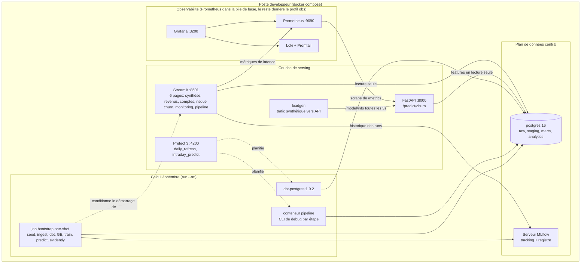

# Architecture

## 1. Topologie physique

Tous les services tournent en local via `docker compose up -d`. Treize services
sur un seul réseau bridge (`cairn_network`), sept volumes nommés
(`postgres_data`, `mlflow_artifacts`, `mlflow_data`, `prometheus_data`,
`loki_data`, `promtail_positions`, `grafana_data`). Neuf services composent la
pile de base (dont Prometheus, que la page Pipeline interroge); Grafana, Loki
et Promtail sont isolés derrière le profil `obs`.



Le service `bootstrap` est la pièce maîtresse de la séquence de démarrage : un
job à exécution unique (même image que Prefect) qui déroule le pipeline complet
avant que Streamlit ne soit autorisé à démarrer. Streamlit en dépend via
`service_completed_successfully`, si bien que le dashboard ne s'ouvre jamais
sur une base vide. Il est idempotent (seed UUID5 + ingestion ON CONFLICT,
tables dbt, prédictions upsertées), donc chaque `docker compose up` peut le
rejouer sans risque.

## 2. Plan de données

### 2.1 Schémas Postgres

| Schéma       | Rôle                                       | Qui écrit                   |
|--------------|--------------------------------------------|-----------------------------|
| `raw`        | Source de vérité, append-only              | `ingestion.loaders.load_csv`|
| `staging`    | Vues dbt, types normalisés                 | `dbt run` (stg_*)           |
| `marts`      | Tables dbt, schéma en étoile               | `dbt run` (dim_* / fct_* / mart_*) |
| `analytics`  | Sorties du modèle + audit                  | `ml.predict`, `api.main`    |

L'initialisation vit dans `sql/init.sql`, monté dans le répertoire
`/docker-entrypoint-initdb.d/` du conteneur postgres. Le script crée les
schémas, les tables raw, les PK, les FK, les index, ainsi que la table cible
`analytics.churn_predictions`.

### 2.2 Garantie d'idempotence

`ingestion.loaders.load_csv` effectue un **full refresh** calé sur la clé
naturelle, si bien que la couche raw reflète toujours exactement le dernier
instantané du seed :

```sql
CREATE TEMP TABLE _stage (LIKE raw.accounts INCLUDING ALL) ON COMMIT DROP;
COPY _stage FROM STDIN WITH (FORMAT CSV, HEADER);

-- 1. suppression des lignes absentes du nouvel instantané (évite l'accumulation)
DELETE FROM raw.accounts t
WHERE NOT EXISTS (SELECT 1 FROM _stage s WHERE s.account_id = t.account_id);

-- 2. upsert des lignes de l'instantané
INSERT INTO raw.accounts SELECT * FROM _stage
ON CONFLICT (account_id) DO UPDATE SET ...;
```

Conséquence : le pipeline de bootstrap (ou n'importe quelle étape isolée comme
`make seed` / `make ingest`) peut être relancé autant de fois que nécessaire
et aboutit toujours à l'instantané courant exact, sans lignes orphelines
accumulées d'une génération de seed à l'autre. C'est précisément ce qui
maintient au vert les tests dbt d'unicité et de non-chevauchement des
abonnements : un chargement en insertion seule empilerait des lignes périmées
sur les nouvelles à chaque changement de génération. Le test d'intégration
`test_ingest_roundtrip.py` vérifie qu'un rechargement laisse le nombre de
lignes inchangé.

### 2.3 Schéma en étoile dans `marts`

```
                 dim_date        dim_plan
                     │               │
        dim_account ─┼──fct_mrr_monthly
                     │               │
                     ├──fct_mrr_movements
                     │               │
                     ├──fct_engagement_daily
                     │               │
                     ├──fct_tickets_monthly
                     │               │
                     └── mart_account_health (plat, 1 ligne par compte)
                     │
               dim_industry
```

`mart_account_health` est la jointure canonique utilisée à la fois par le
constructeur de features ML et par les onglets Santé / Risque de Streamlit.
Cette centralisation évite toute divergence de définition entre le dashboard
et le modèle.

## 3. Plan de calcul

### 3.1 Modèle éphémère

`seed`, `ingestion`, `dbt`, `ml.train`, `ml.predict`, `great_expectations`
et `monitoring.evidently_jobs` s'exécutent tous comme des invocations
`docker compose run --rm` de l'image `pipeline` (ou `dbt`). Ils démarrent,
font leur travail, écrivent dans Postgres / MLflow / `data/`, puis se
terminent. **Rien n'est persistant côté calcul.**

Pourquoi c'est important :

* **Compatible CI** : les mêmes commandes tournent dans GitHub Actions sans
  serveur Prefect.
* **Résilient aux plantages** : une étape en échec laisse son état dans
  Postgres, où le run suivant peut reprendre, et non dans des objets en
  mémoire à moitié initialisés.
* **Simple à faire monter en charge** : la même image pipeline peut être
  lancée via `docker run` sur une machine plus musclée pour un backfill
  nocturne.

### 3.2 Orchestration Prefect

`flows/flows.py` enveloppe chaque CLI dans une `@task` dotée d'une politique
de retry :

```python
@task(retries=3, retry_delay_seconds=[30, 120, 300])
def ingest(): …
```

Deux flows :

* **`daily_refresh`** (cron `0 2 * * *`) : seed, ingest, dbt build, GE,
  train, predict, evidently. Environ 90 minutes de bout en bout sur le volume
  de données de référence.
* **`intraday_predict`** (cron `0 */2 * * *`) : predict, puis evidently.
  Environ 2 minutes. Assez léger pour que les derniers scores aient toujours
  moins de 2 h.

Le serveur Prefect 3 et son worker embarqué tiennent dans un seul conteneur
(`flows/Dockerfile`), les déploiements étant créés au démarrage.

## 4. Plan de serving

### 4.1 FastAPI (`:8000`)

* **Endpoints :** `/health`, `/model/info`, `/predict/churn` (unitaire),
  `/batch/predict` (≤ 5 000 comptes par requête).
* **Chargement du modèle :** `api.model_loader.ModelBundle` est un singleton
  paresseux qui privilégie le pickle XGBoost, avec une sémantique de reset
  pour les tests.
* **Schémas :** modèles Pydantic v2 dans `api/schemas.py` : `AccountFeatures`,
  `PredictionResponse` (validé entre 0 et 100), `BatchPredictRequest/Response`,
  `HealthResponse`, `ModelInfoResponse`. Le niveau de risque est un `Literal`.
* **Seuils de niveaux :** 0.75 : critical, 0.50 : high, 0.25 : medium, sinon
  low. Choisis à partir de la courbe de calibration sur la tranche Q4 mise de
  côté.

### 4.2 Streamlit (`:8501`, hôte `:8601`)

Six pages (point d'entrée `app.py` + `pages/`), en divulgation progressive :

1. **Synthèse** (`pages/overview.py`) : instantané exécutif du revenu, des
   mouvements nets, de la santé des comptes et du risque de churn.
2. **Revenus** (`pages/revenue.py`) : MRR/ARR, waterfall, NRR, GRR (depuis
   `fct_mrr_movements`).
3. **Santé des comptes** (`pages/accounts.py`) : distribution du score de
   santé, découpages par cohortes, détail par compte.
4. **Risque de churn** (`pages/churn_risk.py`) : liste au niveau compte,
   filtrable par niveau de risque, avec les facteurs SHAP.
5. **Monitoring** (`pages/monitoring.py`) : historique GE + Evidently + MLflow.
6. **Pipeline** (`pages/pipeline.py`) : runs Prefect, fraîcheur de
   l'ingestion, latence de l'API (Prometheus) et statut du modèle, avec des
   labels live/démo par source.

### 4.3 MLflow (conteneur `:5000`, hôte `:5001`)

Tracking et registre adossés à SQLite sur un volume nommé (`mlflow_data`); les
artefacts sur un second volume nommé (`mlflow_artifacts`), si bien qu'un
`docker compose down` (sans `-v`) préserve les deux. L'enregistrement du
modèle lors de `ml.train` est **conditionné au dépassement du PR-AUC du
champion en titre** : un mécanisme challenger/champion à moindre coût. L'API
sert délibérément le bundle pickle local plutôt que de tirer depuis le
registre (aucune dépendance réseau sur le chemin de serving); le registre est
la piste d'audit, pas le mécanisme de déploiement.

## 5. Justification des choix techniques

| Choix                          | Pourquoi ce choix et pas un autre                    |
|--------------------------------|------------------------------------------------------|
| **Postgres** (et non Snowflake/BigQuery) | Local, gratuit, reproductible; c'est le pipeline qui est mis en avant, pas le warehouse. `make up` amorce toute la pile sur un laptop en 10 min environ. |
| **dbt-postgres 1.9**           | Mature, gratuit, couvre 100 % des besoins de modélisation; aucun besoin de se verrouiller sur Fabric ou Dataform. |
| **Great Expectations (en code)** | L'arborescence complète d'un projet GE est surdimensionnée pour 5 suites; `great_expectations/suites.py` sous forme de tuples déclaratifs plus un petit runner obtient le même résultat en 200 lignes de code. |
| **Evidently 0.4**              | Drift et performance open source dans un seul rapport; s'intègre proprement sous Prefect. Se replie sur un simple résumé JSON si les dépendances lourdes ne sont pas installées. |
| **XGBoost + baseline LogReg**  | La LogReg fournit un plancher calibré et inspectable; XGBoost gagne environ 8 à 12 points de PR-AUC sur cette forme de données. Le TreeExplainer SHAP est assez rapide pour produire les facteurs par compte au moment de la prédiction. |
| **Prefect 3** (et non Airflow) | Pythonique, les retries tiennent en un argument nommé, l'interface est claire et le serveur tient dans un seul conteneur. |
| **FastAPI** (et non Flask)     | Les schémas Pydantic v2 offrent documentation et validation gratuites. L'async d'`uvicorn` suffit largement au volume d'appels de l'outil CS. |
| **MLflow**                     | Tracking, registre et stockage d'artefacts, le tout sur le Postgres déjà en place. Pas de second datastore, pas d'inscription à un SaaS. |
| **Streamlit**                  | Le chemin le plus court d'un DataFrame pandas à un outil qu'un CRO ouvrira vraiment. La découverte automatique des pages garde Monitoring comme point d'entrée séparé. |

## 6. Ce qui est volontairement écarté

* **Kafka / streaming d'événements** : le cas d'usage exige une réactivité
  quotidienne, pas à la seconde. Un cron plus Prefect est le bon outil.
* **Kubernetes** : `docker compose` se lit plus vite, démarre plus vite et
  correspond exactement à ce que la CI GitHub Actions exerce.
* **Feature store** : `mart_account_health` plus une liste de features
  versionnée dans `ml/features.py` couvre le besoin pour 1 % de la complexité.
* **Montée en charge de l'inférence en ligne** : FastAPI avec un seul worker
  uvicorn absorbe le trafic de l'outillage CS. Le jour où cela ne suffit plus,
  le bundle est sans état et le passage à l'échelle se résume à un HPA k8s.
